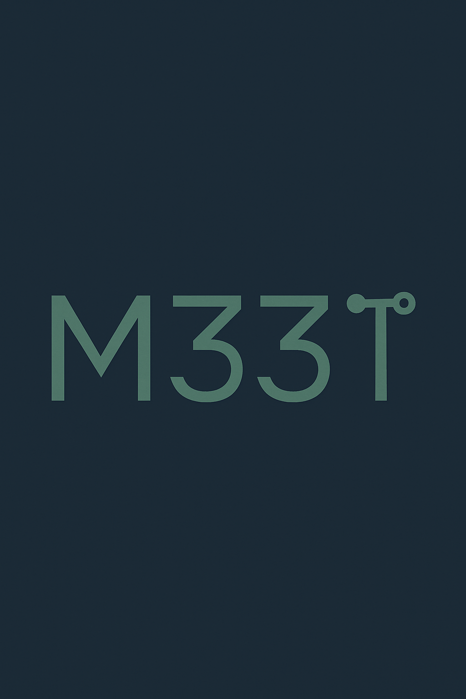

# M33T | Web3 Event Platform

## Overview

M33T is a cutting-edge Web3 platform designed to revolutionize event creation and management. In the Web3 market, there is a noticeable lack of events and platforms dedicated to fostering community engagement and interaction. This project was conceived to address this market gap by providing a seamless and innovative solution for event creation and management, specifically tailored for the Web3 ecosystem.

Through M33T, event owners can promote Web3-focused events and build vibrant communities around them. Participants are required to prove token ownership and stake as part of their access to exclusive event benefits. This proof of stake not only grants access but also unlocks the ability to purchase event-related items with enhanced advantages and enjoy unique perks available only to verified token holders.

To further support the ecosystem, M33T leverages Meteora’s DAMM v2 to bootstrap a one-sided liquidity pool without requiring a quote token. This enables swaps of the event token with zero initial capital beyond Solana gas fees, lowering barriers to liquidity and allowing the event token economy to flourish organically from day one.

Additionally, M33T integrates Circle Wallets, eliminating the complexity of external wallet management for users. By handling wallet ownership seamlessly within the platform, M33T removes one of the key barriers to Web3 adoption, allowing participants to focus on engaging with events, staking tokens, and unlocking benefits — all without worrying about traditional crypto wallet setup and security.

### Addressing the Market Gap

The Web3 ecosystem has seen rapid growth in decentralized finance (DeFi), NFTs, and blockchain-based applications. However, the event management space remains underdeveloped, leaving communities and businesses without effective tools to organize and participate in decentralized events. M33T bridges this gap by offering:

- **Decentralized Event Hosting**: Empowering users to create and manage events without relying on centralized platforms.
- **Blockchain Transparency**: Leveraging blockchain technology to ensure secure, immutable, and transparent event data.
- **Global Accessibility**: Enabling users from around the world to participate in events using digital wallets and stablecoins.

### Unique Value Proposition

By integrating blockchain technology and digital wallets, M33T offers a unique value proposition for users and businesses looking to host or participate in decentralized events. Key benefits include:

- **Enhanced Security**: Blockchain ensures that event data and transactions are secure and tamper-proof.
- **Seamless Payments**: Integration with Circle Wallet allows for easy and secure payment processing using stablecoins like USDC.
- **Community Engagement**: Tools like interactive event cards and personalized forms foster greater interaction and participation.

### Use Case Example: Decentralized Conference

Imagine hosting a global Web3 conference where attendees can:

1. **Register with Digital Wallets**: Users authenticate using their wallets, ensuring secure and decentralized access.
2. **Pay with Stablecoins**: Attendees can get tickets proving assets.
3. **Create event exclusive wallets**: All events gonna have their own wallet generated and managed by Circle, providing the platform an exclusive experience.
4. **Participate in Blockchain-Backed Events**: All users can have the experience of swaping tokens to the event tokens into M33T platform too.
5. **Engage with Interactive Features**: Users can interact with event content through dynamic cards and real-time updates.

M33T makes this vision a reality, providing the tools and infrastructure needed to bring decentralized events to life.

## Key Benefits

1. **Market Differentiation**:
   - A pioneering platform in the Web3 space, addressing the scarcity of event-focused solutions.
   - Combines the power of blockchain with user-friendly interfaces to attract both tech-savvy and non-technical users.

2. **Enhanced User Experience**:
   - Simplifies the process of creating and managing events with intuitive tools.
   - Provides secure and transparent transactions through blockchain integration.

3. **Business Opportunities**:
   - Enables businesses to connect with a growing Web3 audience.
   - Offers sponsorship and partnership opportunities within the decentralized ecosystem.

## Project Structure

Below is an overview of the main folders and files in the project:

### interface-layer/
This folder contains the user interface layer, built with **Next.js** and **Tailwind CSS**. Key components include:

- **app/**: Pages and routes of the application, such as:
  - `api/`: API routes for authentication and blockchain interactions (e.g., `auth/wallet-signin`, `solana/create-transaction`).
  - `event-creation/`: Page for creating events.
  - `register/`: User registration page.
- **components/**: Reusable components like forms, event cards, and layouts.
  - **ui/**: A library of UI components such as buttons, inputs, modals, etc.
- **contexts/**: Global contexts, such as `wallet-context` for managing digital wallet states.
- **hooks/**: Custom hooks like `use-mobile` and `use-toast`.
- **lib/**: Utility functions, including Solana integration and wallet session management.
- **styles/**: Global style files.
- **types/**: TypeScript definitions, such as the `event` type.

## Technologies Used

- **Next.js**: React framework for server-side rendering and static site generation.
- **Tailwind CSS**: Utility-first CSS framework for styling.
- **TypeScript**: JavaScript superset that adds static typing.
- **Solana**: Blockchain used for transactions and digital wallet creation.
- **Circle Wallets**: Creation of wallets by the events owner.

## Core Features

1. **Event Creation and Management**:
   - Intuitive forms for creating personalized events.
   - Interactive cards to display event details.

2. **Blockchain Integration**:
   - Authentication via digital wallets.
   - Transaction creation on the Solana blockchain.

3. **Reusable Components**:
   - A comprehensive UI library for building consistent interfaces quickly.

## Circle Wallet Integration

M33T integrates with **Circle Wallet**, a robust digital payment solution, to provide users with secure and seamless wallet creation and management. This integration enhances the platform's payment capabilities, making it easier for users to interact with Web3 events.

### What is Circle Wallet?

Circle Wallet is a digital payment solution developed by Circle, a leader in blockchain-based financial services. It allows users to:

- **Create Digital Wallets**: Easily set up wallets for managing digital assets.
- **Transact with Stablecoins**: Use USDC and other stablecoins for secure and efficient payments.
- **Leverage Blockchain Infrastructure**: Benefit from Circle's reliable and scalable blockchain technology.

### How Circle Wallet Enhances M33T

By integrating Circle Wallet, M33T offers:

- **Simplified Wallet Management**: Users can create and manage wallets directly within the platform.
- **Secure Event Payments**: Attendees can pay for events using USDC, ensuring fast and secure transactions.
- **Global Accessibility**: Circle Wallet's support for stablecoins enables users from around the world to participate in events without currency conversion issues.

### Use Case Example: Event Payments with Circle Wallet

Imagine an attendee registering for a Web3 event on M33T:

1. **Wallet Creation**: The attendee creates a digital wallet through Circle Wallet integration.
2. **Payment with USDC**: The attendee pays for the event using USDC, processed securely via Circle's infrastructure.
3. **Instant Confirmation**: The payment is confirmed instantly, and the attendee receives access to the event.

This integration ensures a smooth and secure payment experience, aligning with M33T's mission to simplify Web3 event management.
